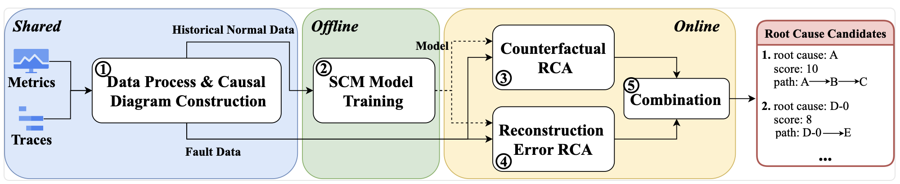

## 1 CauseLens整体架构

## 2 数据预处理
如果目标数据不存在，需要进行这一步预处理。数据集下载：`https://doi.org/10.5281/zenodo.14840230`。
### 2.1 aiops_2022
- 原始数据：存放于`datasets/aiops_2022/raw`。
- 处理脚本：修改`scripts`目录下的脚本`data_process_aiops_2022.py`和`start_data_process_aiops_2022.py`中的路径参数，运行`start_data_process_aiops_2022.py`脚本处理每一天的数据。
- 目标数据：处理后`datasets/aiops_2022`下生成`groundtruth_csv`和`graph`。
### 2.2 trainticket_2024
- 原始数据：存放于`datasets/trainticket_2024`。
- 处理脚本：修改`scripts`目录下的脚本`data_process_trainticket_2024.py`和`start_data_process_trainticket_2024.py`中的路径参数，运行`start_data_process_trainticket_2024.py`脚本处理每一天的数据。
- 目标数据：处理后`datasets/trainticket_2024`下生成`groundtruth_csv`，`graph_1`，`graph_2`。
## 3 代码运行
- 运行环境：
```
pip install -r requirement.txt
```
- 参数设置：命令行参数定义在`parse.py`,具体的值参考`.vscode/launch.json`中的配置。每个数据集有3个配置，分别用于3种模式：`train`,`rca_prepare`,`rca`。实验时，按照次序运行这3种模式。
- 运行命令：
```bash
python main.py --<args_name> <args_value>
```
- 目录`RCA/cache`中存放了数据的缓存文件，如果修改了数据处理相关参数，需要先删除对应数据集的缓存文件。
- 运行结果：存放在`RCA/models/<dataset>/CustomGAE/model_<date>/`下面，包含模型文件，中间数据，rca结果。
## 4 结果示例
