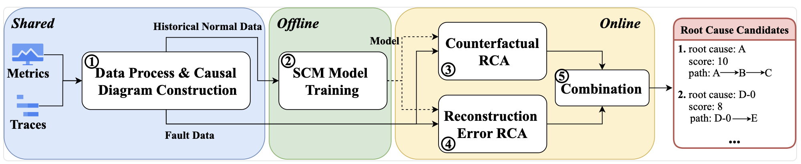
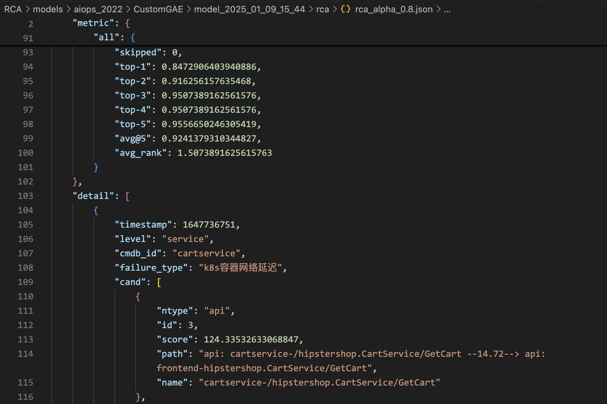

## 1 CauseLens Overall Architecture


## 2 Data Preprocessing
Perform this step if the target data does not exist. Dataset download: `https://doi.org/10.5281/zenodo.14840230`.

### 2.1 aiops_2022
- Raw Data: Stored in `datasets/aiops_2022/raw`
- Processing Scripts: Modify path parameters in `scripts/data_process_aiops_2022.py` and `scripts/start_data_process_aiops_2022.py`, then run `start_data_process_aiops_2022.py` to process daily data.
- Target Data: After processing, `groundtruth_csv` and `graph` will be generated under `datasets/aiops_2022`.

### 2.2 trainticket_2024
- Raw Data: Stored in `datasets/trainticket_2024`
- Processing Scripts: Modify path parameters in `scripts/data_process_trainticket_2024.py` and `scripts/start_data_process_trainticket_2024.py`, then run `start_data_process_trainticket_2024.py` to process daily data.
- Target Data: After processing, `groundtruth_csv`, `graph_1`, and `graph_2` will be generated under `datasets/trainticket_2024`.

## 3 Code Execution
- Environment Setup:
```
pip install -r requirement.txt
```
- Parameter Configuration: Command-line parameters are defined in `parse.py`, with specific values referenced from configurations in `.vscode/launch.json`. Each dataset has 3 configurations corresponding to 3 modes: `train`, `rca_prepare`, and `rca`. Run these modes sequentially during experiments.
- Execution Command:
```bash
python main.py --<args_name> <args_value>
```
- Cache files are stored in `RCA/cache`. Delete cached files for corresponding datasets if data processing parameters are modified.
- Results: Stored under `RCA/models/<dataset>/CustomGAE/model_<date>/`, including model files, intermediate data, and RCA results.

## 4 Result Examples
